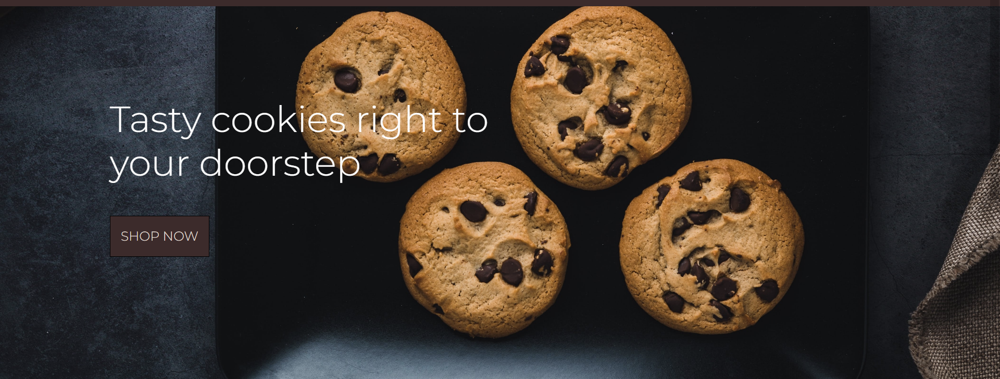
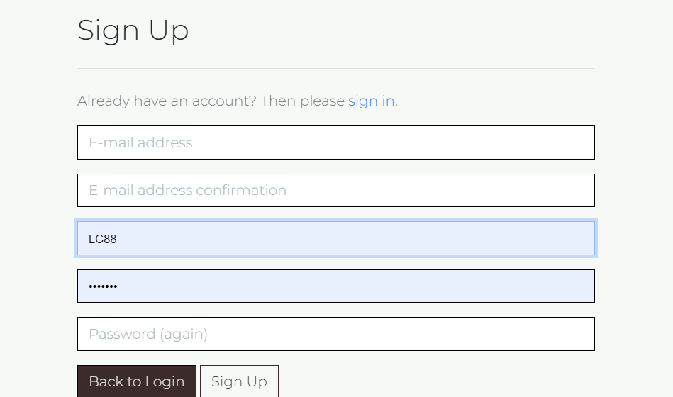
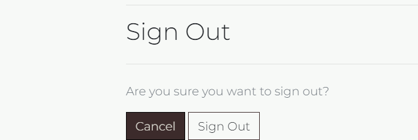
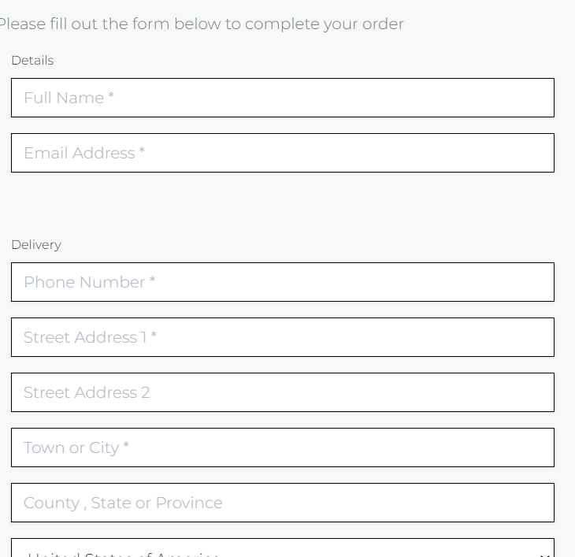
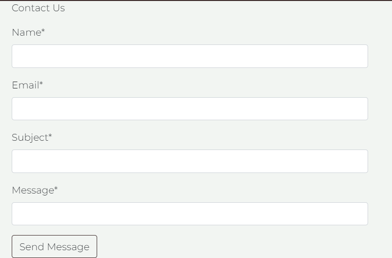

# Introduction
The Cookie Dough Company is an e-commerce website in the field of food

The website was built using the Django framework in Python

## Contents 

[User Experience (UX)](#user-experience-ux)
* [User Stories](#user-stories)
    - [EPIC | Inital setup, registration](#EPIC-|-Inital-setup-registration)
    - [EPIC | View and Navigate products](#EPIC-|-View-and-Navigate-products)
    - [EPIC | Purchasing and Checkout](#EPIC-|-Purchasing-and-Checkout)
    - [EPIC | Admin and User Profile functionaility](#EPIC-|-Admin)
[Design](#design)
* [Colour Scheme](#colour-scheme)
* [Fonts](#fonts)
* [Imagery](#imagery)
* [Wireframes](#wireframes)
* [Database Schema](#database-schema)
* [Business Model](#business-model)
* [Marketing](#marketing)
* [Search Engine Optimisation](#search-engine-optimisation)

[Features](#features)
* [Nav Bar](#nav-bar)
    - [Links](#links)
    - [Search Bar](#search-bar)
    - [Bag](#bag)
    - [Account](#account)
* [Home page](#home-page)
    - [Hero Image](#hero-image)
    - [Footer](#footer)
* [Account](#accounts)
    - [Register Page](#register-page)
    - [Login Page](#login-page)
    - [Log Out Page](#log-out-page)
* [Profile](#profile)
    - [Delivery Details](#delivery-details)
    - [Order History](#order-history)
* [All Products](#all-products)
    - [Sorting](#sorting)
    - [Products](#products)
* [Product Details](#product-details)
    - [Product Info](#product-info)
    - [Like Button](#like-button)
    - [Quantity](#quantity)
    - [Reviews](#reviews)
    - [Add Review](#add-review)
* [Product Management](#product-management)
    - [Add Product](#add-product)
    - [Edit Product](#edit-product)
    - [Delete Product](#delete-product)
* [Bag](#bag)
    - [Items](#add-product)
    - [Quantity and Price](#quantity-and-price)
    - [Total](#total)
* [Checkout](#checkout)
    - [Details](#details)
    - [Order Summary](#order-summary)
    - [Payment](#payment)
    - [Confirmation](#confirmation)
* [Contact](#contact)
    - [Message](#message)
* [Toasts](#toasts)
* [404 Page](#404-page)

[Technologies Used](#technologies-used)
* [Languages](#languages)
* [Libraries](#libraries)

[Testing](#testing)
  
[Deployment](#deployment)
* [Github](#github)
    -[Forking](#forking)
    -[Clone](#clone)
* [Heroku](#heroku)
* [AWS](#clone)
    -[S3](#s3)
    -[IAM](#iam)
* [Stripe](#Stripe)

[Credits](#credits)
* [Code](#code)
* [Media](#media)

## User Experience (UX)
### User Stories
#### Epic: Inital setup, registration
- As a site user, I want to log in so that I can access my account 
- As a site user, I want to verify my email address so that I can make my account secure 

#### Epic: View and Navigate products
 - As a site user, I want to view a list of products so that I can purchase one
 - As a site user, I want to search through available products so that I can find a product by name or description
 - As a site user, I want to sort the available products so that I can Identify the best price and best rated 
 - As a site user, I want to leave reviews on products so that I can let the business owner know my thoughts of the product

#### Epic: Purchasing and Checkout
- As a site user, I want to view bag items so that I can see what products I have added to my bag
- As a site user, I want to edit bag items so that I can delete or update the quantites of the products I have in my bag
- As a site user, I want to purchase bag items so that I can receive the items that I want. 

#### Epic: Admin and User Profile functionaility
- As an admin, I want to manage products so that I can create, update and delete them when necessary.

## Design
### Colour Scheme 
To fit in with the sites theme I went for colours of cookies, the main colour being brown and then soft white to balance the darkness out.

### Fonts
Both fonts are from Google Fonts.

Montserrat is used for paragraphs and general text

Lato is used for headings
### Wireframes
Wireframes can be found here:
- [Home Page](assets/images/home.png)
- [Products Page](assets/images/products.png)
- [Bag Page](assets/images/bag.png)
- [Checkout Page](assets/images/checkout.png)
- [Checkout Success Page](assets/images/checkout-success.png)

### Database Scheme 
My original database scheme can be seen here:

This is not reflective of the final project as I had added reviews to the project.

### Business Model
The business model for this store is a B2C (Business to Customer) model, as the business would be selling products directly from themselves to the customer.

### Marketing
The site uses two different marketing strategies, social media and a newsletter that users can sign up to.

- Links to all the social media sites are located at the top of the footer. A Facebook page was set up for the business

- The newsletter signup form is located at the bottom of the footer.

### Search Engine Optimisation
To optimise the site for search engines, a sitemap.xml and robots.txt files have been created. 

Long-tail and short-tail keywords were added to the meta tag within the base.html file. These were selected based on their relevance to the products.

## Features
### Nav Bar
#### Links

- To help navigate the user around, there are four links to the main sections of the site at the top of every page.

- The links collapse into a hamburger menu once the screen size becomes too small.

- The Product and all Product link drops down into a sub-menu where the user can navigate to all products or choose from two different categories.

#### Search Bar

- The Search Bar is located in the middle of the navbar and can be used to search for products.

#### Bag

- The bag is located to the right on the navbar, next the the accounts menu.

- Users can see the total cost of the items in their bag underneath the bag icon.

- Clicking the bag icon brings users to the shopping bag page where they can see a summary of what they've added in.

#### Account

- The accounts menu is located to the right on the navbar.

- Clicking the icons opens a dropdown menu.

- If the user is signed in, the dropdown options are My Profile, Logout, and Product Management.

### Home Page
#### Hero Image

- The hero image displays a message welcoming the user to the site.

- The image will change depending on the size of the screen.

#### Footer

- The footer appears at the bottom of every page.

- The footer contains social media links and a newsletter signup form.

- Clicking the social media links will take you to the relevant website.

- The Newsletter section has an option to input your email and sign up for the monthly newsletter.

### Accounts
#### Register Page 

- The register page is used for a user to create an account.

#### Login Page

- The login page is used for users to log in with an existing account.

#### Log Out Page

- The logout page is used to for users who are signed in to log out.

### Profile 
#### Delivery Details

- The delivery details section stores the user's delivery address and phone number.

- The information that is used here is used to autofill the delivery address when placing an order.

#### Order History 

- The order history section is a table that keeps a record of every order the user has placed.

- The table displays the order number, date it was ordered, items ordered, quantities of items and the order total.

- Clicking the order number takes the user to a more detailed summary of the order.

### All Products 
#### Sorting 

- The sort-by box is located to the top right of the products section.

- Clicking the box opens up a dropdown menu with various options on how to sort the products.

#### Products 

- Each product card shows an image of the product, its name, price and category.

### Product Details 
#### Product Info 

- The product info section shows information about the product along with a button to add the item to the user's favourite list, and buttons to add the item to the bag in multiple quantities.

- There is a like button at the top of the product info section, along with a count of how many likes a product has.

- If the user is a super user, edit and delete buttons will appear beside the product image.

#### Like button

- A like button is featured on the product details page.

- Users can see from how many likes whether the product is popular or not

#### Favourites 

- The favourite button is located underneath the product's name.

- Favouriting a product adds the product to the user's favourite items list, the user is notifited when they have favourited a product.

- On the favourites page, the user can delete the product from their favourites and are notifited when they have.

#### Quantity 

- The quantity buttons are located beside the product image and are used to add items to the bag.

- The plus and minus buttons increase and decrease the value.

- If the value is set to 1 the minus quantity will be disabled. If the value is set to 99 the plus button is disabled.

- Clicking the 'Add to Bag' button adds the quantities selected of the products to the bag.

- Clicking the 'Add to Bag' button when the input is blank adds one item to the bag.

#### Reviews

- If the product has any reviews they will appear underneath the product details.

- The reviews consist of the users written review, along with the user name and when the review was commented 

- If the user is signed in and they have left a review on a product, that review will also have edit and delete buttons. Only owners of the review can edit or delete them.

### Product Management
#### Add Product

- The add product page is accessed by the account dropdown menu, under product management and can only be accessed by superusers.

- The user must fill out all the fields that are labelled 'required'. If the form is submitted with any of these fields left blank then an error message will appear above that particular field, notifying the user of the issue.

- The SKU field must be unique. An error message will appear if an existing SKU is entered.

- If a price is added with more than 6 digits the form will fail and an error message will appear under the price field.

- The user has the option to add an image. If none is chosen then a default image is used.

- Clicking the 'Add Product' button at the bottom of the form will create the product.

#### Edit Product

- The Edit product page can only be accessed by superusers.

- The Edit Product page can be accessed by clicking the edit button located beside the image on the products detail page.

- Accessing the page loads the details of the product already filled in but can be edited.

- Clicking the 'Update Product' button will save any changes made to the existing product.

#### Delete Product

- Only superusers can delete products.

- The Delete Product button can be accessed by clicking the edit button located beside the image on the products detail page.

- Clicking the delete button will bring up a warning modal, asking the user if they are sure they want to delete the product.

- If the user clicks the delete button the product will be removed from the database.

- If the user presses the cancel button the modal closes and no changes are saved.

### Bag
#### Items 

- The bag page displays all items that the user has added to it.

- The page will list the items added with its image, along with its names and SKU.

#### Quantity and Price 

- The price and quantity section includes the product's price, the quantity in the bag, and the subtotal of that item's line.

- The quantity section has buttons either side for the user to increase or decrease the total of that item in the bag.

- Beside the subtotal is the update and delete buttons.

- Clicking the update button saves any changes to the quantity and updates the item's subtotal.

- Clicking the remove button removes the item completely from the user's bag.

- Manually inputting the number zero or anything below and clicking update will remove the item from the bag.

#### Total 

- At the end of the line items is a summary of the costs.

- The summary features the bags total, delivery charges and the grand total.

- Underneath the grand total, users will either find a message informing them of how much more they need to spend to receive free delivery. 

- Beneath the grand total is two buttons. From here the user can either continue to the checkout or return to the products page by clicking Continue Shopping.

### Checkout 
#### Details 

- The details section appears on the left to the order summary.

- The user fills out their contact details, delivery address, and card number here.

- If the user is signed in a checkbox to save the delivery information can be checked.

- If the user is signed in and has delivery information saved, the delivery details and email address will be automatically filled in.

#### Order Summary 

- The order summary section appears on the right of the checkout details.

- This section lists all the items about to be purchased, along with the quantity, order total, delivery charge and grand total.

- Below the order summary is a number reflecting the total number of items in the order.

#### Card Details 

- Below the delivery details is the card payment box which is run by Stripe.

- At the end of the section is a button to complete the order or to return back to the bag. There is also a warning message informing the user of how much their card is about to be charged.

#### Confirmation 

- Once the order has been processed the user is taken to the checkout success page.

- This page summarises the completed order. It lists the order number, order date, the items ordered with their quantities, the delivery address, and the billing info.

- A confirmation email is also sent to the email address provided.

- At the end of the summary is a button that takes the user back to the main shop.

### Contact
#### Message

- The message section enables the user to send a message. All the fields are required.

- Once all the fields are completed, hitting the 'Send Message' button will send the message.

### Toasts 

- Toasts appear in the top right-hand corner of the display informing the user of any actions they have performed.

### 404 page
- If any links are broken or the user types in an address that doesn't exist, a 404 error page will be shown.

## Technologies Used
### Languages 
- HTML
- CSS
- Javascript
- Python

### Libraries
- [Git](https://git-scm.com/) Version control
- [Github](https://github.com/) Used to store the code repository 
- [Gitpod](https://www.gitpod.io/) Used to build and edit code
- [Django](https://www.djangoproject.com/) Python based framework to develop the site
- [Bootstrap](https://getbootstrap.com/) Used for design
- [Google fonts](https://fonts.google.com/) For fonts used throughout the site
- [Font Awesome](https://fontawesome.com/) Icons used 
- [AWS](https://aws.amazon.com/) Used to store static files and images
- [PostgreSQL](https://www.elephantsql.com/) Database used
- [Crispy Forms](https://django-crispy-forms.readthedocs.io/en/latest/) Used to ender forms
- [Google developer tools](https://developer.chrome.com/docs/devtools/) Used to fix problems and bugs
- [Stripe](https://stripe.com/en-ie) Used to take payments
- [Heroku](https://www.heroku.com/) Used to deploy the project

### Testing 
- Testing can be found [here](TESTING.md).

### Deployment 
#### Github
#### Forking
- Log in to Github

- Navigate to the Github repository 

- Click Fork in the top right hand corner

#### Clone 
The repository can be cloned by following these steps:

- Log into GitHub and go to the GitHub Repository
- Click on the code button on the right above the files list
- Then select HTTPS and copy the URL
- Open Git Bash
- Change the current working to the location you want the cloned directory to be
- Type git clone and paste the URL from earlier
- Press enter to create the local clone

#### Heroku 
- Go to the Heroku website (https://www.heroku.com/)
- Login to Heroku and select Create App
- Click New and Create a new app
- Enter a name and select location
- Click on create new app
- Go to the Settings tab
- Add all nessecary config vars
- Navigate to the Deploy tab
- Click on Connect to Github and search for the repository
- Navigate to enable automatic deployments and enable
- Navigate to manual deploy and click on deploy branch

### AWS
- Sign up to AWS which you can do [here](https://aws.amazon.com/).
- Once you have created an account and logged in, under the All Services search for S3.
- On the S3 page you will need to create a new bucket. To do this click the orange button that says Create Bucket.
- Name the bucket and select your region. 
- Under Object Ownership select ACLs enabled and leave the Object Ownership as Bucket owner preferred. 
- Uncheck the Block all public access checkbox and check the warning box so that the bucket will be made public, then click create bucket. 
- Click the bucket's name and navigate to the properties tab. Scroll to the bottom and under Static website hosting click edit and change the Static website hosting option to enabled. Copy the default values for the index and error documents and click save changes.
- Navigate to the permissions tab, scroll down to the Cross-origin resource sharing (CORS) section, click edit and paste in the following code:  

    [
    {
    "AllowedHeaders": [
    "Authorization"
    ],
    "AllowedMethods": [
    "GET"
    ],
    "AllowedOrigins": [
    "*"
    ],
    "ExposeHeaders": []
    }
    ]

- Scroll up to the Bucket Policy section. Click edit and then click Policy generator. 
- From here under the select type of policy dropdown menu, select S3 Bucket Policy. Then inside Principle allow all principals by typing a *.
- From the Actions dropdown menu select Get object. Then head back to the previous tab and locate the Bucket ARN number. Copy that, return to the policy generator and paste it in the field labelled Amazon Resource Name.
- Click Add statement, then Generate Policy. Copy the policy that's been generated and paste it into the bucket policy editor.
- Add a /* at the end of the resource key. This is to allow access to all resources in this bucket.
- Save this, then scroll down to the Access control list section and click edit.
- Next to Everyone (public access), check the list checkbox. This will pop up a warning box that you will also have to check, then click 'save'. 

### IAM
- In the search bar at the top of the window, search for IAM and select it.
- Then click User Groups from the side bar, then click Create group.
- Name the group and click Create group at the bottom of the page. 
- Then from the sidebar click Policies, then Create policy.
- Go to the JSON tab and click import managed policy. Search for S3 and select AmazonS3FullAccess and click import.
- Go back to the bucket and copy the ARN number. Head back to this policy and update the Resource key to include the ARN, and another line with the ARN followed by a /*. 

- Click Next: Tags, Next: Review, and on this page give the policy a name. Then click Create policy.
- To attach it to the group that was created, click User groups, and click the group that was created earlier. Go to the permissions tab and click Add permission and from the dropdown click Attach policies. 
- Find the policy just created, select it and click Add permissions.
- To create a user to put in the group, select users from the sidebar and click Add user.  
- Give the user a user name, check Programmatic Access, then click Next: Permissions. 
- Select the group that has the policy attached and click Next: Tags, Next: Review, then Create user.
- On the next page, download the CSV file. This contains the user's access key and secret access key. 

- Back in S3, go to the bucket and click Create folder. Name the folder media and click Save. 
- Inside the new media folder, click Upload, add files, and then select all your images.
- Then under Permissions select the option Grant public-read access and click upload. 

#### Stripe
Stripe is used to process payments at the checkout 
- Create a Stripe account

- Navigate to the dashboard

- From there click API keys for developers

- Below Standard Keys are the Publishable key and Secret key

### Credits 
#### Code 
- Boutique Ado was used as a basis throughout this project, with a lot of the functionality taken from it.

- [Delboy DryDrops Repository](https://github.com/Delboy/DryDrops/tree/main) Code for the review feature was adapted from this repository, along with the structure of the readme file from this repository was used to inform this readme file.

- [Stackoverflow](https://stackoverflow.com/) was also used to fix bugs and setup functionality.

#### Media 
All images taken from [Unsplash](https://unsplash.com/)
- [Salted caramel](https://unsplash.com/photos/OfdDiqx8Cz8)
- [Chocolate Chip](https://unsplash.com/photos/rjf4FcmERGc)
- [Double Chocolate](https://unsplash.com/photos/Ms9xBg3Gtr8)
- [Loftus Biscoff](https://unsplash.com/photos/EnPlEZI4WfM)
- [Chocolate Orange](https://unsplash.com/photos/4fl4XVhH8Y4)
- [Taster](https://unsplash.com/photos/H1uISjlRXJE)
- [Mix](https://unsplash.com/photos/4Mh3AjljekQ)
- [Brownie](https://unsplash.com/photos/1rqk6XVnw44)
- [Sprinkle](https://unsplash.com/photos/JnpoOdKCm1Q)

